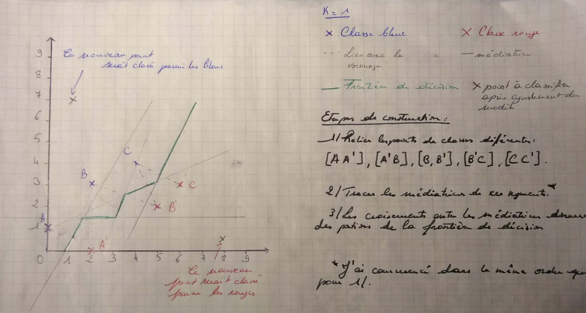
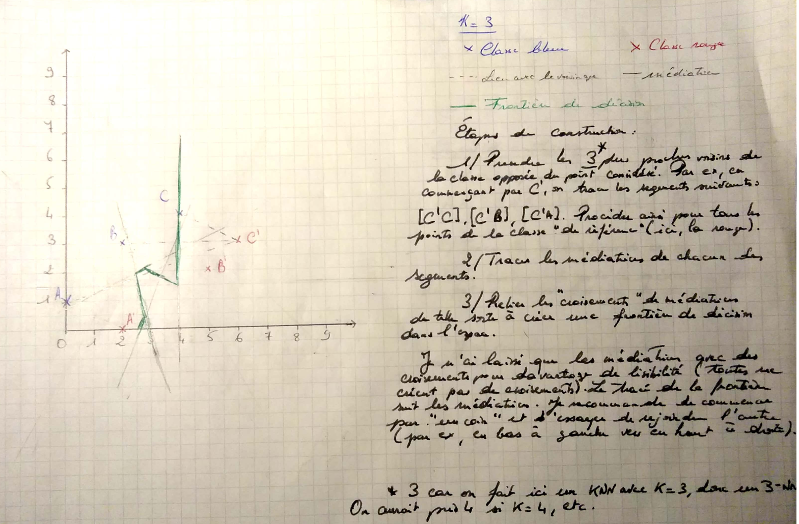

# Préambule

Le présent document a pour objectif de présenter synthétiquement - et au fur et
à mesure des séances - la solution du TD 4 correspondant au cours de Statistique
descriptive 2 dispensé en L2 MIASHS à l'Université Lumière Lyon 2 par [Stéphane CHRÉTIEN](https://sites.google.com/site/stephanegchretien/enseignement/l2-miashs-statistiques-descriptives/l2-statistiques-descriptives-2-regression-et-classification). Les consignes et le corrigé sont trouvables dans le répertoire `doc` ; `data` contient pour sa part les jeux de données utilisés dans le cadre du TD dans des formats simples d'usage.

*Ce document n'est pas un tutoriel pour R, et n'a pas pour but de remplacer le CM. En revanche, c'est la suite directe des TDs précédents, [trouvables ici](https://github.com/users/mpalenciaolivar/projects/4)*.

# Ressources utiles

## Ressources internet

- [K-Nearest Neighbors Algorithm](https://medium.com/analytics-vidhya/k-nearest-neighbors-algorithm-7952234c69a4)

- [KNN Algorithm in R](https://eshitanandy.medium.com/knn-algorithm-in-r-30dff0c8d094)

# Exercices

Pour un résumé des explications données en TD et un approfondissement du K-NN, on se réfèrera aux ressources internet ci-dessus. Elles sont en anglais, mais simples d'accès, et surtout, elles sont assez complètes et illustrées ! Cela vaut vraiment le coup d'y jeter un oeil. Le jeu de données pour la partie R est fourni dans le dossier `data`.

## Instructions pour tracer la frontière de décision du K-NN à la main

